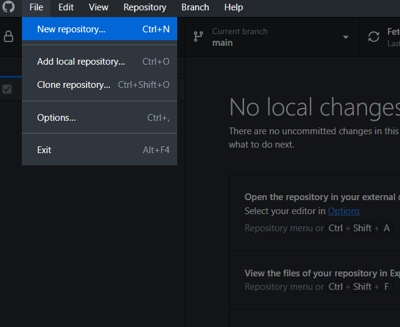
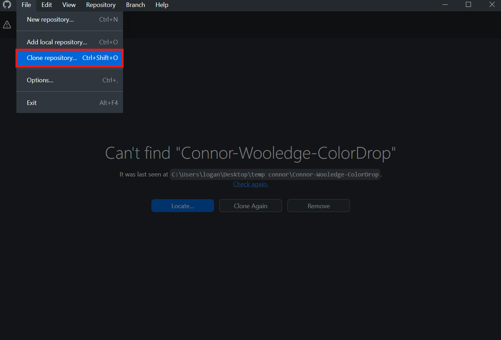

# VEX GitHub Instructions

This guide walks you through how to **save a VEX IQ project to GitHub** and how to **retrieve it from GitHub** later on. It's designed to be used by students and instructors alike, and assumes you are using **GitHub Desktop** and **VEXcode IQ**.

---

## 📚 Table of Contents

- [Part 1: Saving a VEX IQ Project to GitHub](#part-1-saving-a-vex-iq-project-to-github)
  - [Step 1: Create a New Repository](#step-1-create-a-new-repository)
  - [Step 2: Configure Local Repository](#step-2-configure-local-repository)
  - [Step 3: Set to Public Repository](#step-3-set-to-public-repository)
  - [Step 4: Publish to GitHub](#step-4-publish-to-github)
  - [Step 5: Save VEX IQ Code to Repository](#step-5-save-vex-iq-code-to-repository)
  - [Step 6: Commit Your Changes](#step-6-commit-your-changes)
  - [Step 7: Push to GitHub](#step-7-push-to-github)
  - [Step 8: Verify Upload](#step-8-verify-upload)
- [Part 2: Cloning and Opening a GitHub Project](#part-2-cloning-and-opening-a-github-project)
  - [Step 1: Clone the Repository](#step-1-clone-the-repository)
  - [Step 2: Choose Local Directory](#step-2-choose-local-directory)
  - [Step 3: Open the File in VEXcode IQ](#step-3-open-the-file-in-vexcode-iq)
  - [Step 4: You're Done!](#step-4-youre-done)

---

## Part 1: Saving a VEX IQ Project to GitHub

> **Note:** If the GitHub repo already exists and you’ve cloned it, you can skip to [Step 6](#step-6-commit-your-changes).

### Step 1: Create a New Repository
  
Open **GitHub Desktop**, ensure you're signed in to the **Dripping Springs** account.  
Go to `File → New Repository`.

---

### Step 2: Configure Local Repository
  
- This creates a **local repo only** (not yet online).
- Name it: `StudentName-cs2n` (e.g., `LoganFalkenberg-cs2n`).
- Choose a **local directory** to save their VEX IQ project.
- Click **Create Repository**.

---

### Step 3: Set to Public Repository  
  
At the top, click the **"Public Repository"** toggle.

---

### Step 4: Publish to GitHub  
  
- Click **"Publish repository"**.  
- Keep the name the same: `StudentName-cs2n`.
- Leave the description blank.
- Keep it **private**.
- Click **Publish**.

---

### Step 5: Save VEX IQ Code to Repository  
  
Open the VEX IQ project, then go to `File → Save As`.

  
- Navigate to the **local repo directory** (you should see a `.git` file there).
- Save the file as `StudentName-ProjectName` (e.g., `LoganFalkenberg-ObstacleAvoidance.iqcpp`).
- Click **Save**.

---

### Step 6: Commit Your Changes  
  
- In **GitHub Desktop**, you’ll see the new file listed.
- Write a commit message (e.g., "Completed autonomous code").
- Click **"Commit to main"**.

---

### Step 7: Push to GitHub  
  
Click **"Push origin"** to upload the commit to GitHub.

---

### Step 8: Verify Upload  
  
Go to [github.com](https://github.com) → navigate to the repo you just edited.  
You should see the new `.iqcpp` file in the list.

✅ You're done!

---

## Part 2: Cloning and Opening a GitHub Project

### Step 1: Clone the Repository  
  
Open GitHub Desktop → `File → Clone repository`.

---

### Step 2: Choose Local Directory  
  
- Search for the student’s repo (e.g., `LoganFalkenberg-cs2n`).
- Select it and choose or create a **local directory**.
- Click **Clone**.

---

### Step 3: Open the File in VEXcode IQ  
  
In VEXcode IQ, go to `File → Open`.

  
- Navigate to the local repo directory you just cloned.
- Select the `.iqcpp` project file.
- Click **Open**.

---

### Step 4: You're Done!  
  
The file is now open and ready to be edited locally in VEXcode IQ.  
✅ That’s it!

---

## 📌 Reference Image Index

| Step | Image | Description |
|------|-------|-------------|
| Step 1 | `1.png` | New repo in GitHub Desktop |
| Step 2 | `2.png` | Configure local repo |
| Step 3 | `3.png` | Make repo public |
| Step 4 | `4.png` | Publish repo to GitHub |
| Step 5 | `5.png`, `5.1.png` | Save VEX project to local repo |
| Step 6 | `6.png` | Commit changes |
| Step 7 | `7.png` | Push to GitHub |
| Step 8 | `8.png` | Verify on GitHub.com |
| Clone Steps | `11.png`, `12.png`, `13.png`, `14.png`, `15.png` | Cloning and opening files |

---

